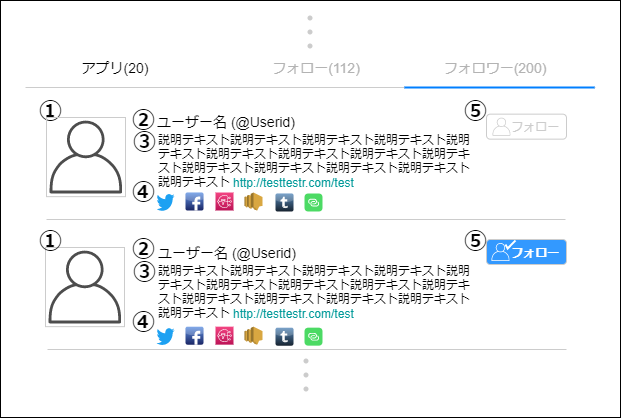

# 画面設計書(ユーザーフォロワー)

### 画面レイアウト

### 画面項目一覧

| No.   | 項目名                   | 種類   | 有効 | 桁数     | 必須 | データ型 | 全半角       | 制約 | 初期表示 | 備考                            |
| :---- | :----------------------- | :----- | :--- | :------- | :--- | :------- | :----------- | :--- | :------- | :------------------------------ |
| **1** | ユーザー画像             | 画像   | 〇   | -        | -    | -        | -            | -    | 〇       | -                               |
| **2** | ユーザー名 ユーザーID | ラベル | -    | 20 20 | -    | 文字列   | 全角 半角 | -    | 〇       | -                               |
| **3** | ユーザー説明             | ラベル | 〇   | 200      | -    | 文字列   | 全角         | -    | 〇       | リンクが貼られて いる時のみ |
| **4** | 主要アプリ               | 画像   | 〇   | -        | -    | -        | -            | -    | 〇       | -                               |
| **5** | フォロー                 | ボタン | 〇   | -        | -    | -        | -            | -    | 〇       | -                               |

### 画面アクション定義

| No.   | 項目 | アクション名 | イベント名             | アクション処理概要                                      | アクション処理詳細 | 遷移先/呼出機能                                              | 備考 |
| :---- | :--- | :----------- | :--------------------- | :------------------------------------------------------ | :----------------- | :----------------------------------------------------------- | ---- |
| **1** | -    | 初期表示1    | -                      | ユーザー情報を取得し表示する                            | -                  | [フォロワー情報一覧取得機能](../../3_dd/3.3.3.APIDesign.html) | -    |
| **2** | 1    | 画像押下1    | ユーザー画像押下       | ユーザー画像を 押下すると ポップアップ表示する   | -                  | -                                                            | -    |
| **3** | 3    | リンク押下1  | ユーザー説明リンク押下 | ユーザー説明内のリンクを 押下すると 画面遷移する | -                  | リンク先ページ                                               | -    |
| **4** | 4    | 画像押下2    | 主要アプリ押下         | 主要アプリ画像を 押下すると 画面遷移する         | -                  | 外部アプリページ                                             | -    |
| **5** | 5    | ボタン押下   | フォローボタン押下     | ① フォローの状態でフォロー ボタンを押下すると、フォローして、 ボタンをフォロー済の状態にする。 ② フォロー済の状態でフォロー ボタンを押下すると、フォロー解除して、 ボタンをフォローの状態にする。 | フォロー => ① フォロー解除 => ② | ① [フォロー情報追加機能](../../3_dd/3.3.3.APIDesign.html) ② [フォロー情報削除機能](../../3_dd/3.3.3.APIDesign.html) | -    |
