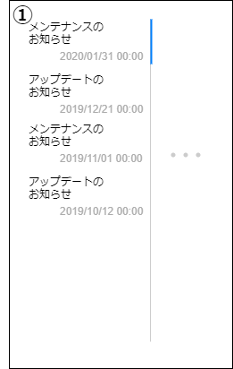

# 画面設計書(通知一覧)

### 画面レイアウト

### 画面項目一覧

| No.   | 項目名 | 種類 | 有効 | 桁数 | 必須 | データ型 | 全半角 | 制約                | 初期表示           | 備考 |
| :---- | :----- | :--- | :--- | :--- | :--- | :------- | :----- | :------------------ | :----------------- | :--- |
| **1** | 各通知 | タブ | 〇   | -    | -    | -        | -      | yyyy/MM/dd hh:mm:ss | 通知名 通知日時 | -    |

### 画面アクション定義

| No.   | 項目 | アクション名 | イベント名 | アクション処理概要 | アクション処理詳細 | 遷移先/呼出機能 | 備考 |
| :---- | :--- | :----------- | :--------- | :----------------- | :----------------- | :----- | ---- |
| **1** | 1 | 初期表示1 | - | 通知情報を取得しその一部 (通知名/通知日時)を一覧表示する | - | [通知情報リスト取得機能](../../3_dd/3.3.3.APIDesign.html) | - |
| **2** | 2 | 通知タブ押下 | タブ押下 | 小画面で該当の通知情報を表示する | - | [通知詳細画面](./sc041.html) | - |

