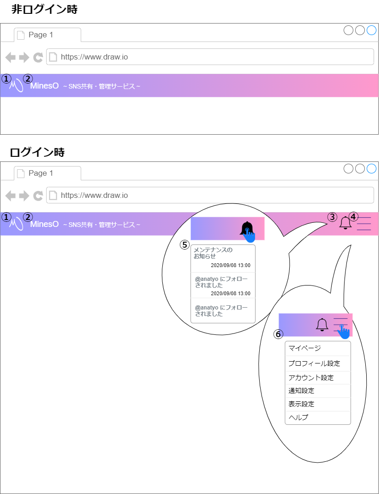

# 画面設計書(画面共通)

## ヘッダー

### 画面レイアウト

### 画面項目一覧

|  No.  | 項目名           |      種類      | 有効 | 初期表示 |    備考    |
| :---: | :--------------- | :------------: | :--: | :------: | :--------: |
| **1** | ロゴアイコン     |      画像      |  〇  |    〇    |     -      |
| **2** | タイトル         |    テキスト    |  〇  |    〇    |     -      |
| **3** | 通知アイコン     |      画像      | ※〇  |   ※〇    | ログイン時 |
| **4** | メニューアイコン |      画像      | ※〇  |   ※〇    | ログイン時 |
| **5** | 通知パネル       | ドロップダウン | ※〇  |   ※〇    | ログイン時 |
| **6** | メニューパネル   | ドロップダウン | ※〇  |   ※〇    | ログイン時 |

### 画面アクション定義

| No.  | 項目 | アクション名 |  イベント名  |        アクション処理概要        |       アクション処理詳細       |   遷移先   |
| :--: | :----------: | :----------: | :------------------------------: | :--- | :--------- | :--- |
| **1** |  1  |  画面遷移1   |   ロゴ 押下   |   ロゴを押下すると 画面遷移する   | 非ログイン時①に遷移にする ログイン時②に遷移する |   ①[About](./sc1.html) ②[マイページ](./sc2.1.html)   |
|  **2**  |  2  |  画面遷移2   | タイトル 押下 | タイトルを押下すると 画面遷移する | 非ログイン時①に遷移にする ログイン時②に遷移する | ①[About](./sc1.html) ②[マイページ](./sc2.1.html) |
| **3** | 3 | パネル表示1 | 通知アイコン 押下 | 通知アイコンを押下すると 通知パネルを表示する | - | - |
| **4** | 4 | パネル表示2 | メニューアイコン 押下 | メニューアイコンを押下すると メニューパネルを表示する | - | - |
| **5** | 5 | 画面遷移3 | 通知 押下 | 通知パネル内の通知を 押下すると 通知詳細画面に遷移する | 運営からの通知 ⇒ ①に遷移 フォローの通知 ⇒ ②に遷移 | ①[通知詳細](./sc7.html) ②[フォロワー一覧](./sc4.html) |
| **6** | 6 | 画面遷移4 | メニュー 押下 | メニューパネル内の項目を 押下すると 該当の画面に遷移する | マイページ ⇒ ① 設定 ⇒ ② ヘルプ ⇒ ③ | ①[マイページ](./sc2.1.html) ②[設定](./sc8.html) ③[ヘルプ](./sc9.html) |

***

## フッダー

### 画面レイアウト

### 画面項目一覧

| No.  |    項目名    |  種類  | 有効 | 初期表示 |
| :--: | :----------: | :----: | :--: | :------: |
|  1   |    About     | ボタン |  〇  |    〇    |
|  2   |    ヘルプ    | ボタン |  〇  |    〇    |
|  3   | プライバシー | ボタン |  〇  |    〇    |
|  4   |    ご意見    | ボタン |  〇  |    〇    |
|  5   |   Twitter    | ボタン |  〇  |    〇    |
|  6   |    著作権    | ラベル |  -   |    〇    |

### 画面アクション定義

|No.|項目|アクション名|イベント名|アクション処理概要|遷移先|
|:-:|:-:|:-:|:-:|:-:|:-:|
|1|1|画面遷移1|About ボタン押下|Aboutボタンを押下すると 画面遷移する|[About](./sc1.html)|
|2|2|画面遷移2|ヘルプ ボタン押下|ヘルプボタンを押下すると 画面遷移する|[ヘルプ](./sc9.html)|
|3|3|画面遷移3|プライバシー ボタン押下|プライバシーボタンを押下すると 画面遷移する|[プライバシー](./sc11.html)|
|4|4|画面遷移4|ご意見 ボタン押下|ご意見ボタンを押下すると 画面遷移する|[ご意見](./sc12.html)|
|5|5|画面遷移5|Twitter ボタン押下|Twitterボタンを押下すると 画面遷移する|公式Twitter|

