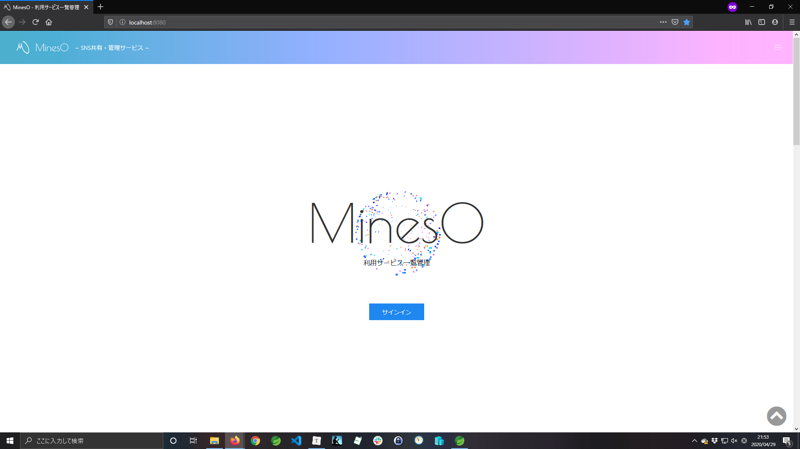

# 画面設計書(TOP画面)

### 画面レイアウト

### 画面項目一覧
| No.  |     項目名     |  種類  | 有効 | 桁数 | 必須 | データ型 | 全半角 | 制約 | 初期表示 | 備考/アクションNo. |
| :--: | :------------: | :----: | :--: | :--: | :--: | :------: | :----: | :--: | :------: | :----------------: |
|  1   |      ロゴ      |  画像  |  -   |  -   |  -   |    -     |   -    |  -   |   画像   |  No.2と同一/No.1   |
|  2   | サイトタイトル | ラベル |  〇  |  6   |  -   |  文字列  |  半角  |  -   |  MinesO  |  No.1と同一/No.1   |
|  3   |                |        |      |      |      |          |        |      |          |                    |
|  4   |                |        |      |      |      |          |        |      |          |                    |
|  5   |                |        |      |      |      |          |        |      |          |                    |
|  6   |                |        |      |      |      |          |        |      |          |                    |
|  7   |                |        |      |      |      |          |        |      |          |                    |

### 画面アクション定義

|No.|アクション名|イベント名|アクション処理概要|入力|アクション処理詳細|遷移先|出力|
|:-:|:-:|:-:|:-:|:-:|:-:|:-:|:-:|
|1||||||||
|||||||||
|||||||||
|||||||||