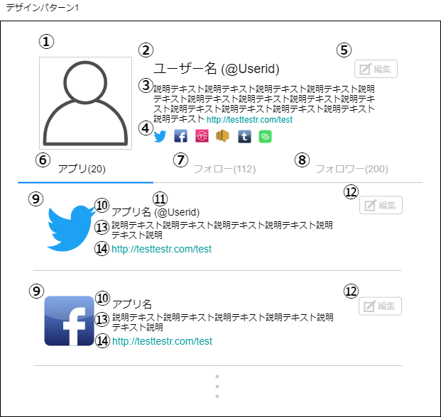
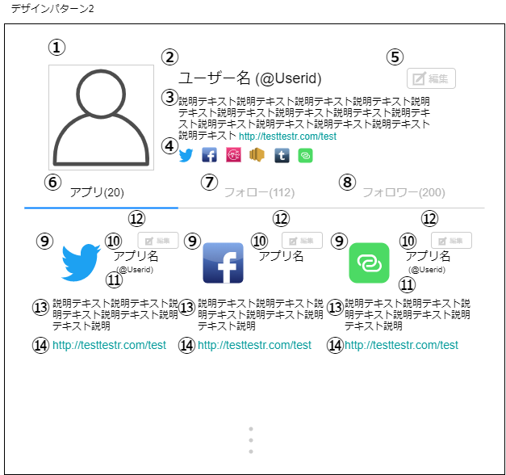
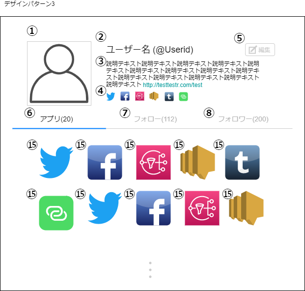

# 画面設計書(ユーザー詳細画面)

### 画面レイアウト

### 画面項目一覧
| No.  |     項目名     |  種類  | 有効 | 桁数 | データ型 | 全半角 | 初期表示 | 備考 |
| :-- | :-- | :-- | :-- | :-- | :------ | :-- | :-- | :-- |
| **1** | ユーザー画像 | 画像 | 〇 | - | - | - | 〇 | - |
|  **2**  | ユーザー名 ユーザーID | ラベル | - | 20 20 | 文字列 | 全角 半角 | 〇 | - |
|  **3**  | ユーザー説明 | ラベル | 〇 | 200 | 文字列 | 全角 | 〇 | リンクが貼られて いる時のみ |
|  **4**  | 主要アプリ | 画像 | 〇 | - | - | - | 〇 | - |
|  **5**  | ユーザー編集 | ボタン | 〇※ | - | - | - | 〇※ | ログイン時 |
|  **6**  | アプリタブ | タブ | - | - | - | - | 〇 | - |
|  **7**  | フォロータブ | タブ | 〇 | - | - | - | 〇 | - |
|  **8**  | フォロワータブ | タブ | 〇 | - | - | - | 〇 | - |
| **9** | アプリアイコン1 | 画像 | 〇 | - | - | - | 〇 | - |
| **10** | アプリ名 | リンク | 〇 | 20 | 文字列 | 全角 | 〇 | - |
| **11** | アプリユーザーID | リンク | 〇 | 20 | 文字列 | 全角 | 〇 | - |
| **12** | アプリ編集 | ボタン | 〇※ | - | - | - | 〇※ | ログイン時 |
| **13** | アプリ説明 | ラベル | 〇※ | 200 | 文字列 | 全角 | 〇 | リンクが貼られて いる時のみ |
| **14** | アプリリンク | リンク | 〇 | 20※ | 文字列 | 半角 | 〇 | 表示部を20字に切り取り |
| **15** | アプリアイコン2 | リンク | 〇 | - | - | - | 〇 | - |

### 画面アクション定義

|No.|項目|アクション名|イベント名|アクション処理概要|遷移先|出力|備考|
|:-:|:-:|:--|:--|:--|:--|:--|:--|
|**1**|1|画像押下1|ユーザー画像押下|ユーザー画像を 押下すると ポップアップ表示する||ユーザー画像||
|**2**|3|リンク押下1|ユーザー説明リンク押下|ユーザー説明内のリンクを 押下すると 画面遷移する|リンク先ページ|||
|**3**|4|画像押下2|主要アプリ押下|主要アプリ画像を 押下すると 画面遷移する|外部アプリページ|||
|**4**|5|ボタン押下1|ユーザー編集押下| ユーザー編集ボタンを 押下すると 画面遷移する |[ユーザー編集](./sc2.2.html)||ログイン時|
|**5**|7|タブ押下2|フォロー押下|フォロータブを 押下すると 画面遷移する|[フォロー一覧](./sc3.html)|||
|**6**|8|タブ押下3|フォロワー押下|フォロワータブを 押下すると 画面遷移する|[フォロワー一覧](./sc4.html)|||
|**7**|  9   |  画像押下3   |  アプリアイコン1押下  |アプリアイコン1画像を 押下すると 画面遷移する|[アプリ詳細](./sc6.1.html)|||
|**8**|10|リンク押下2|アプリ名押下|アプリ名リンクを 押下すると 画面遷移する|[アプリ詳細](./sc6.1.html)|||
|**9**|11|リンク押下3|アプリユーザーID押下|アプリユーザーIDリンクを 押下すると 画面遷移する|外部アプリページ|||
|**10**|12|ボタン押下2|アプリ編集押下|アプリ編集ボタンを 押下すると、 画面遷移する|[ユーザーアプリ編集](./sc2.3.html)||ログイン時|
|**11**|13|リンク押下4|アプリ説明リンク押下|アプリ説明内のリンクを 押下すると 画面遷移する|リンク先ページ|||
|**13**|14|リンク押下|アプリリンク押下|アプリリンクを 押下すると 画面遷移する|アプリページ|||
|**14**|15|画像押下4|アプリアイコン2押下|アプリアイコン2画像を 押下すると 画面遷移する|[アプリ詳細](./sc6.1.html)||||