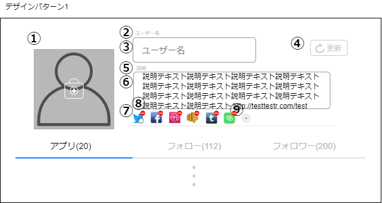

# 画面設計書(ユーザー編集画面)

### 画面レイアウト

### 画面項目一覧
| No.  |     項目名     |  種類  | 有効 | 桁数 | 必須 | データ型 | 全半角 | 初期表示 |
| :-- | :------------ | :---- | :-- | :-- | :-- | :------ | :---- | :------ |
| **1** | ユーザー画像 | 画像 | 〇 | - | - | - | - | 〇 |
|  **2**  | ユーザー名ラベル | ラベル | - | - | - | - | - | 〇 |
|  **3**  | ユーザー名入力フォーム | テキストボックス | 〇 | 20 | 〇 | 文字列 | 全角 | 〇 |
|  **4**  | 更新ボタン | ボタン | 〇 | - | - | - | - | 〇 |
|  **5**  | 説明ラベル | ラベル | - | - | - | - | - | 〇 |
|  **6**  | 説明入力フォーム | テキストボックス | 〇 | 200 | 〇 | 文字列 | 全角 | 〇 |
|  **7**  | アプリ主要アイコン | 画像 | 〇 | - | - | - | - | 〇 |
|  **8**  | 削除ボタン | 画像 | 〇 | - | - | - | - | 〇 |
| **9** | 追加ボタン | 画像 | 〇 | - | - | - | - | 〇 |

### 画面アクション定義

|No.|項目|アクション名|イベント名|アクション処理概要|入力|アクション処理詳細|遷移先|
|:-|:-|:-|:-|:-|:-|:-|:-|
|**1**|1|画像押下1|ユーザー画像 押下|ユーザー画像を押下後、 新しいユーザー画像を 選択し、画面に反映する|ユーザー 画像|① ユーザー画像を押下すると、 が端末の画像ファイル 選択が出てくる ② 画像を選択すると、 画像が項目No.1に反映される|-|
|**2**|4|ボタン 押下1|更新ボタン 押下|更新ボタン押下後、 画面の内容を反映する|1, 3, 6, 7|-|[ユーザー詳細](./sc2.1.html)|
|**3**|7|ドラッグ1|アプリ主要 アイコン ドラッグ|アプリ主要アイコンを ドラッグすると、位置を 入れ替えることができる|-|-|-|
|**4**|8|画像押下2|削除ボタン 押下|削除ボタンを押下後、 押下した主要アプリ アイコンを削除する|-|① 削除ボタン押下後、 確認ダイアログが出てくる ② OKを押下すると、 主要アプリアイコンが 画面から消える|-|
|**5**|9|画像押下3|追加ボタン 押下|追加ボタンを押下後、 選択したアプリアイコン を主要アプリアイコン に追加する|-|① 追加ボタンを押下後、 アプリ選択画面が出てくる ② アプリを選択すると、 選択したアプリアイコンが 主要アプリアイコンに追加される|-|

