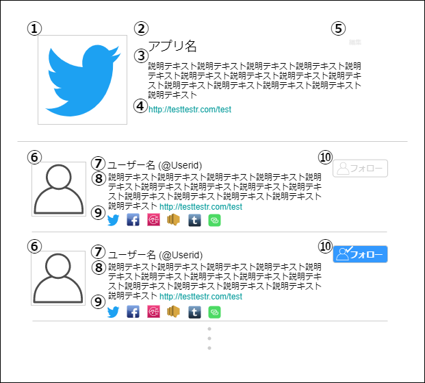

# 画面設計書(アプリ詳細画面)

### 画面レイアウト

### 画面項目一覧
| No.  |     項目名     |  種類  | 有効 | 桁数 | 必須 | データ型 | 全半角 | 制約 | 初期表示 | 備考 |
| :-- | :------------ | :---- | :-- | :-- | :-- | :------ | :---- | :-- | :------ | :---------------- |
| **1** |            |    |     |     |     |         |       |     |      |     |
| **2** |  |  |    |    |     |    |    |    |    |    |
| **3** |                |        |      |      |      |          |        |      |          |                    |
| **4** |                |        |      |      |      |          |        |      |          |                    |
| **5** |                |        |      |      |      |          |        |      |          |                    |
| **6** |                |        |      |      |      |          |        |      |          |                    |
| **7** |                |        |      |      |      |          |        |      |          |                    |

### 画面アクション定義

|No.|項目|アクション名|イベント名|アクション処理概要|入力|アクション処理詳細|遷移先|出力|備考|
|:-|:-|:-|:-|:-|:-|:-|:-|:-|---|
|**1**||||||||||
|||||||||||
|||||||||||
|||||||||||