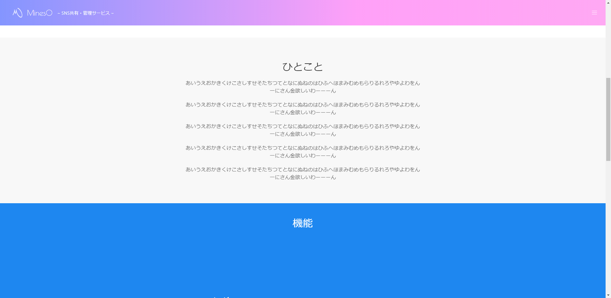
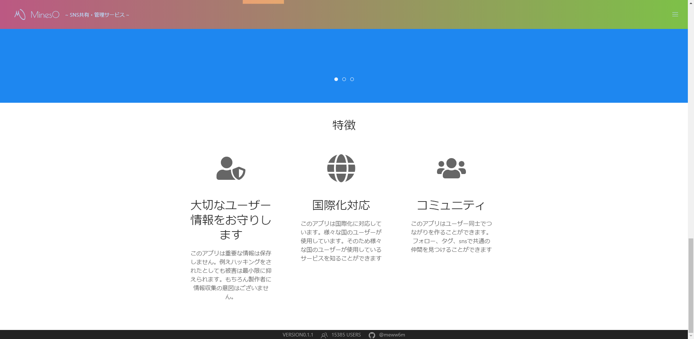

# 画面設計書(TOP画面)

### 画面レイアウト

### 画面項目一覧

|  No.  |     項目名     |  種類  | 有効 | 桁数 | 必須 | データ型 | 全半角 | 制約 | 初期表示 |      備考       |
| :--- | :------------ | :---- | :-- | :-- | :-- | :------ | :---- | :-- | :------ | :------------- |
| **1** |      ロゴ      |  画像  |  -   |  -   |  -   |    -     |   -    |  -   |   画像   | No.2と同一/No.1 |
| **2** | サイトタイトル | ラベル |  〇  |  6   |  -   |  文字列  |  半角  |  -   |  MinesO  | No.1と同一/No.1 |
| **3** |                |        |      |      |      |          |        |      |          |                 |
| **4** |                |        |      |      |      |          |        |      |          |                 |
| **5** |                |        |      |      |      |          |        |      |          |                 |
| **6** |                |        |      |      |      |          |        |      |          |                 |
| **7** |                |        |      |      |      |          |        |      |          |                 |

### 画面アクション定義

|No.|項目|アクション名|イベント名|アクション処理概要|入力|アクション処理詳細|遷移先|出力|備考|
|:-|:-|:-|:-|:-|:-|:-|:-|:-|---|
|**1**||||||||||
|||||||||||
|||||||||||
|||||||||||