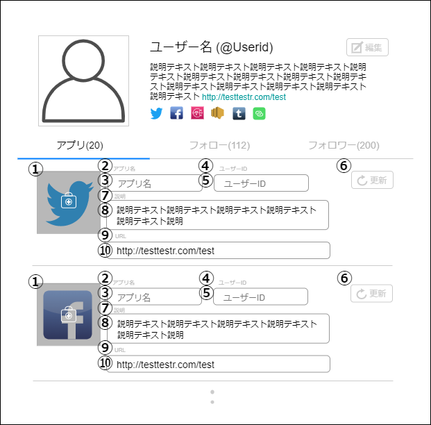

# 画面設計書(ユーザーアプリ編集画面)

### 画面レイアウト

### 画面項目一覧
| No.  |     項目名     |  種類  | 有効 | 桁数 | 必須 | データ型 | 全半角 | 初期表示 |
| :-- | :------------ | :---- | :-- | :-- | :-- | :------ | :---- | :------ |
| **1** | アプリ画像 | 画像 | 〇 | - | - | - | - | 〇 |
| **2** | アプリ名ラベル | ラベル | - | - | - | - | - | 〇 |
| **3** | アプリ名入力フォーム | テキストボックス | 〇 | 20 | 〇 | 文字列 | 全角 | 〇 |
| **4** | ユーザーIDラベル | ラベル | - | - | - | - | - | 〇 |
| **5** | ユーザーID入力フォーム | テキストボックス | 〇 | 20 | - | 文字列 | 全角 | 〇 |
| **6** | 更新ボタン | ボタン | 〇 | - | - | - | - | 〇 |
| **7** | アプリ説明ラベル | ラベル | - | - | - | - | - | 〇 |
| **8** | アプリ説明入力フォーム | テキストボックス | 〇 | 200 | - | 文字列 | 全角 | 〇 |
| **9** | アプリリンクラベル | ラベル | - | - | - | - | - | 〇 |
| **10** | アプリリンクフォーム | テキストボックス | 〇 | 2000 | 〇 | 文字列 | 全角 | 〇 |

### 画面アクション定義

|No.|項目|アクション名|イベント名|アクション処理概要|入力|アクション処理詳細|遷移先|
|:-|:-|:-|:-|:-|:-|:-|:-|
|**1**|1|画像 押下1|アプリ画像 押下|アプリ画像を押下後、 新しいアプリ画像を 選択し、画面に反映する|アプリ 画像|① アプリ画像を押下すると、 が端末の画像ファイル 選択が出てくる ② 画像を選択すると、 画像が項目No.1に反映される|-|
|**2**|6|ボタン 押下1|更新ボタン 押下|更新ボタン押下後、 画面の内容を反映する|3, 5, 8, 10|-|[ユーザー詳細](./sc2.1.html)|

