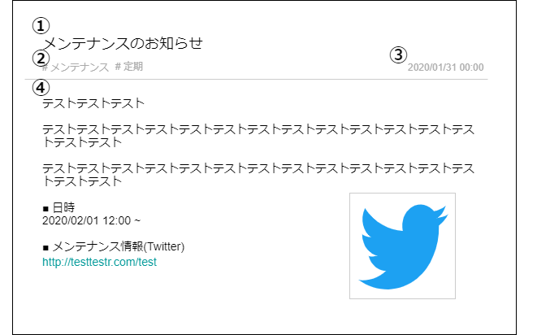

# 画面設計書(通知詳細画面)

### 画面レイアウト

### 画面項目一覧
| No.  |     項目名     |  種類  | 有効 | 初期表示 | 備考 |
| :-- | :------------ | :---- | :-- | :------ | :---------------- |
| **1** | 通知タイトル | ラベル | - | 〇 | - |
| **2** | 通知タグ | ラベル | - | 〇 | - |
| **3** | 通知日時 | ラベル | - | 〇 | - |
| **4** | 通知メッセージ | HTML | 〇 | 〇 | - |

### 画面アクション定義

|No.|項目|アクション名|イベント名|アクション処理概要|入力|遷移先|出力|備考|
|:-|:-|:-|:-|:-|:-|:-|:-|---|
|-|-|-|-|-|-|-|-|-|

