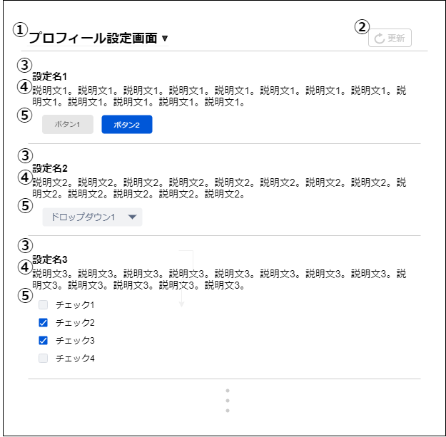

# 画面設計書(各設定画面)

### 画面レイアウト

### 画面項目一覧
| No.  |     項目名     |  種類  | 有効 | 桁数 | 初期表示 | 備考 |
| :-- | :------------ | :---- | :-- | :-- | :------ | :---------------- |
| **1** | 設定タイトル | ドロップダウン | 〇 | - | 〇 | - |
| **2** | 更新ボタン | ボタン | 〇 | - | 〇 | - |
| **3** | 設定名 | ラベル | - | - | 〇 | - |
| **4** | 設定詳細 | ラベル | - | - | 〇 | - |
| **5** | 設定値 | ※ | - | - | 〇 | ボタン、ドロップダウン、 テキストボックス、チェック ボックス、等 |

### 画面アクション定義

|No.|項目|アクション名|イベント名|アクション処理概要|入力|遷移先|備考|
|:-|:-|:-|:-|:-|:-|:-|---|
|**1**|1|ドロップダウン押下1|設定タイトル押下|設定タイトルを押下 すると、各設定タイトル が出てくる。選択すると 選択した設定画面に遷移する|-|各設定画面|-|
|**2**|2|ボタン押下1|更新ボタン押下|更新ボタン押下後、 画面の内容を反映する|3,4,5|-|-|
|**3**|5|設定値操作1|設定値操作|設定値を設定する|-|-|-|

