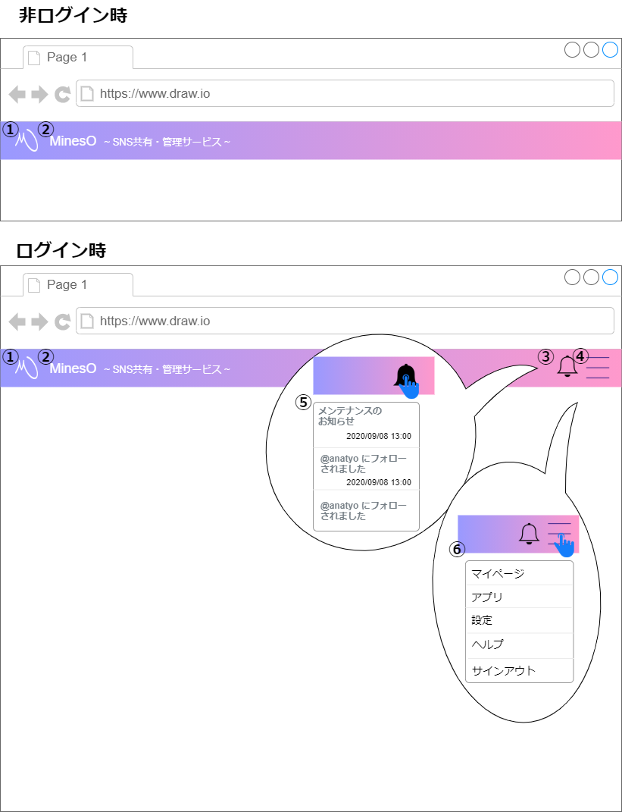
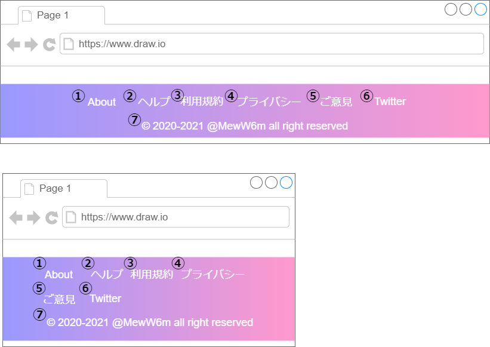

# 画面設計書(画面共通)

## ヘッダー

### 画面レイアウト

### 画面項目一覧

| No.   | 項目名           | 種類           | 有効 | 桁数 | 必須 | データ型 | 全半角 | 制約 | 初期表示 | 備考       |
| :---- | :--------------- | :------------- | :--- | :--- | :--- | :------- | :----- | :--- | :------- | :--------- |
| **1** | ロゴアイコン     | 画像           | 〇   | -    | -    | -        | -      | -    | 〇       | -          |
| **2** | タイトル         | テキスト       | 〇   | -    | -    | -        | -      | -    | 〇       | -          |
| **3** | 通知アイコン     | 画像           | ※〇  | -    | -    | -        | -      | -    | ※〇      | ログイン時 |
| **4** | メニューアイコン | 画像           | ※〇  | -    | -    | -        | -      | -    | ※〇      | ログイン時 |
| **5** | 通知パネル       | ドロップダウン | ※〇  | -    | -    | -        | -      | -    | ※〇      | ログイン時 |
| **6** | メニューパネル   | ドロップダウン | ※〇  | -    | -    | -        | -      | -    | ※〇      | ログイン時 |

### 画面アクション定義

| No.  | 項目 | アクション名 |  イベント名  |        アクション処理概要        |       アクション処理詳細       |   遷移先/呼出機能   |   備考   |
| :-- | :---------- | :----------- | :------------------------------- | :--- | :--------- | :--- | ---- |
| **1** |  1  |  画面遷移1   |   ロゴ押下   |   ロゴを押下すると 画面遷移する   | 非ログイン時①に遷移にする ログイン時②に遷移する |   ①[About](./sc010.html) ②[マイページ](./sc020.html)   | - |
|  **2**  |  2  |  画面遷移2   | タイトル押下 | タイトルを押下すると 画面遷移する | 非ログイン時①に遷移にする ログイン時②に遷移する | ①[About](./sc010.html) ②[マイページ](./sc020.html) | - |
| **3** | 3 | パネル表示1 | 通知アイコン押下 | 通知アイコンを押下すると 通知パネルを表示する | - | - | - |
| **4** | 4 | パネル表示2 | メニューアイコン押下 | メニューアイコンを押下すると メニューパネルを表示する | - | - | - |
| **5** | 5 | 画面遷移3 | 通知押下 | 通知パネル内の通知を 押下すると 任意の画面に遷移する | 運営からの通知 ⇒ ①に遷移 フォローの通知 ⇒ ②に遷移 | ①[通知一覧](./sc040.html) ②[ユーザーフォロー](./sc022.html) | - |
| **6** | 6 | 画面遷移4 | メニュー押下 | メニューパネル内の項目を 押下すると 該当の画面に遷移する | マイページ ⇒ ① アプリ => ② 設定 ⇒ ③ ヘルプ ⇒ ④ サインアウト ⇒ ⑤ | ①[マイページ](./sc020.html) ②[ユーザーアプリ一覧](./sc050.html) ③[設定](./sc051_054.html) ④[ヘルプ](./sc090.html) ⑤[サインアウト](./sc010.html) | - |

***

## フッダー

### 画面レイアウト

### 画面項目一覧

| No.   | 項目名       | 種類   | 有効 | 桁数 | 必須 | データ型 | 全半角 | 制約 | 初期表示 | 備考 |
| :---- | :----------- | :----- | :--- | :--- | :--- | :------- | :----- | :--- | :------- | :--- |
| **1** | About        | ボタン | 〇   | -    | -    | -        | -      | -    | -        | -    |
| **2** | ヘルプ       | ボタン | 〇   | -    | -    | -        | -      | -    | -        | -    |
| **3** | 利用規約     | ボタン | 〇   | -    | -    | -        | -      | -    | -        | -    |
| **4** | プライバシー | ボタン | 〇   | -    | -    | -        | -      | -    | -        | -    |
| **5** | ご意見       | ボタン | 〇   | -    | -    | -        | -      | -    | -        | -    |
| **6** | Twitter      | ボタン | 〇   | -    | -    | -        | -      | -    | -        | -    |
| **7** | 著作権       | ラベル | -    | -    | -    | -        | -      | -    | -        | -    |

### 画面アクション定義

|No.|項目|アクション名|イベント名|アクション処理概要| 遷移先/呼出機能              | 備考 |
|:-|:-|:-|:-|:-|:-|--|
|1|1|画面遷移1|About ボタン押下|Aboutボタンを押下すると 画面遷移する|[About画面](./sc010.html)|-|
|2|2|画面遷移2|ヘルプ ボタン押下|ヘルプボタンを押下すると 画面遷移する|[ヘルプ画面](./sc090.html)|-|
|3|3|画面遷移3|利用規約 ボタン押下|利用規約ボタンを押下すると 画面遷移する|[利用規約画面](./sc100.html)|-|
|4|4|画面遷移4|プライバシー ボタン押下|プライバシーボタンを押下すると 画面遷移する|[プライバシー画面](./sc110.html)|-|
|5|5|画面遷移5|ご意見 ボタン押下|ご意見ボタンを押下すると 画面遷移する|[ご意見画面](./sc120.html)|-|
|6|6|画面遷移6|Twitter ボタン押下|Twitterボタンを押下すると 画面遷移する|公式Twitter|-|

