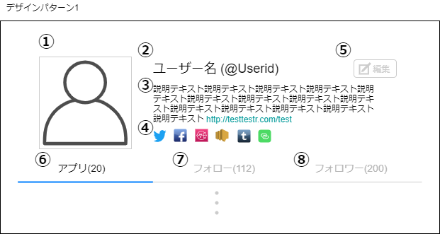
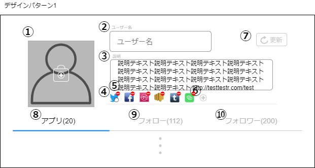

# 画面設計書(ユーザー詳細)

## 表示

### 画面レイアウト

### 画面項目一覧

| No.   | 項目名 | 種類 | 有効 | 桁数 | 必須 | データ型 | 全半角 | 制約 | 初期表示 | 備考 |
| :---- | :----- | :--- | :--- | :--- | :--- | :------- | :----- | :--- | :------- | :--- |
| **1** | ユーザー画像 | 画像 | 〇 | - | - | - | - | - | 〇 | - |
|  **2**  | ユーザー名 ユーザーID | ラベル | - | 20 20 | - | 文字列 | 全角 半角 | - | 〇 | - |
|  **3**  | ユーザー説明 | ラベル | 〇 | 200 | - | 文字列 | 全角 | - | 〇 | リンクが貼られて いる時のみ |
|  **4**  | 主要アプリ | 画像 | 〇 | - | - | - | - | - | 〇 | - |
|  **5**  | ユーザー編集 | ボタン | 〇※ | - | - | - | - | - | 〇※ | ログイン時 |
|  **6**  | アプリタブ | タブ | - | - | - | - | - | - | 〇 | - |
|  **7**  | フォロータブ | タブ | 〇 | - | - | - | - | - | 〇 | - |
|  **8**  | フォロワータブ | タブ | 〇 | - | - | - | - | - | 〇 | - |

### 画面アクション定義

| No.   | 項目 | アクション名 | イベント名 | アクション処理概要 | アクション処理詳細 | 遷移先/呼出機能 | 備考 |
| :---- | :--- | :----------- | :--------- | :----------------- | :----------------- | :----- | ---- |
| **1** | - | 初期表示1 | - | ユーザー情報を取得し表示する | - | [ユーザー情報取得機能](../../3_dd/3.3.3.APIDesign.html) | - |
|**2**|1|画像押下1|ユーザー画像押下|ユーザー画像を 押下すると ポップアップ表示する|-|-|-|
|**3**|3|リンク押下1|ユーザー説明リンク押下|ユーザー説明内のリンクを 押下すると 画面遷移する|-|リンク先ページ|-|
|**4**|4|画像押下2|主要アプリ押下|主要アプリ画像を 押下すると 画面遷移する|-|外部アプリページ|-|
|**5**|5|ボタン押下1|ユーザー編集押下| ユーザー編集ボタンを 押下すると 画面遷移する | - |[ユーザー詳細画面(編集)](./sc020.html#編集)|ログイン時|
|**6**|6|タブ押下1|アプリ押下| アプリタブを 押下すると 画面遷移する | - |[ユーザーアプリ画面](./sc022.html)| -          |
|**7**|7|タブ押下2|フォロー押下|フォロータブを 押下すると 画面遷移する|-|[ユーザーフォロー画面](./sc022.html)|-|
|**8**|8|タブ押下3|フォロワー押下|フォロワータブを 押下すると 画面遷移する|-|[ユーザーフォロワー画面](./sc023.html)|-|

## 編集

### 画面レイアウト

### 画面項目一覧

| No.   | 項目名 | 種類 | 有効 | 桁数 | 必須 | データ型 | 全半角 | 制約 | 初期表示 | 備考 |
| :---- | :----- | :--- | :--- | :--- | :--- | :------- | :----- | :--- | :------- | :--- |
| **1** | ユーザー画像 | 画像 | 〇 | - | - | - | - | - | 〇 | - |
|  **2**  | ユーザー名入力フォーム | テキストボックス | 〇 | 20 | 〇 | 文字列 | 全角 | - | 〇 | - |
|  **3**  | 説明入力フォーム | テキストボックス | 〇 | 200 | 〇 | 文字列 | 全角 | - | 〇 | - |
|  **4**  | アプリアイコン | 画像 | 〇 | - | - | - | - | - | 〇 | - |
|  **5**  | 削除ボタン | 画像 | 〇 | - | - | - | - | - | 〇 | - |
| **6** | 追加ボタン | 画像 | 〇 | - | - | - | - | - | 〇 | - |
|  **7**  | 更新ボタン | ボタン | 〇 | - | - | - | - | - | 〇 | - |

### 画面アクション定義

| No.   | 項目 | アクション名 | イベント名 | アクション処理概要 | アクション処理詳細 | 遷移先/呼出機能 | 備考 |
| :---- | :--- | :----------- | :--------- | :----------------- | :----------------- | :----- | ---- |
|**1**|1|画像押下1|ユーザー画像 押下|ユーザー画像を押下後、 新しいユーザー画像を 選択し、画面に反映する|① ユーザー画像を押下すると、 が端末の画像ファイル 選択が出てくる ② 画像を選択すると、 画像が項目No.1に反映される|-|-|
|**2**|4|ドラッグ1|アプリ主要 アイコン ドラッグ|アプリ主要アイコンを ドラッグすると、位置を 入れ替えることができる|-|-|-|
|**3**|5|画像押下2|削除ボタン 押下|削除ボタンを押下後、 押下した主要アプリ アイコンを削除する|① 削除ボタン押下後、 確認ダイアログが出てくる ② OKを押下すると、 主要アプリアイコンが 画面から消える|-|-|
|**4**|6|画像押下3|追加ボタン 押下|追加ボタンを押下後、 選択したアプリアイコン を主要アプリアイコン に追加する|① 追加ボタンを押下後、 アプリ選択画面が出てくる ② アプリを選択すると、 選択したアプリアイコンが 主要アプリアイコンに追加される|-|-|
|**5**|7|ボタン 押下1|更新ボタン 押下|更新ボタン押下後、 ユーザー情報を更新して、 画面に内容を反映する|-|[ユーザー情報更新機能](../../3_dd/3.3.3.APIDesign.html) [ユーザー詳細画面(表示)](./sc020.html#表示)|-|

