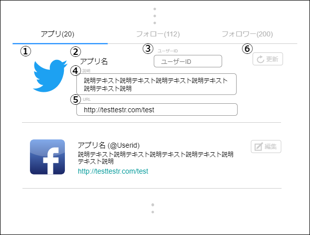

# 画面設計書(ユーザーアプリ)

## 表示

### 画面レイアウト

### 画面項目一覧

| No.   | 項目名 | 種類 | 有効 | 桁数 | 必須 | データ型 | 全半角 | 制約 | 初期表示 | 備考 |
| :---- | :----- | :--- | :--- | :--- | :--- | :------- | :----- | :--- | :------- | :--- |
| **1** | アプリアイコン1 | 画像 | 〇 | - | - | - | - | - | 〇 | - |
| **2** | アプリ名/アプリユーザーID | リンク | 〇 | -    | - | - | - | - | 〇 | - |
| **3** | 非公開アイコン | 画像 | - | - | - | - | - | - | 〇※ | 非公開時のみ。 ユーザー自身しか見れない |
| **4** | アプリ説明 | ラベル | 〇※ | - | - | - | - | - | 〇 | リンクが貼られて いる時のみ |
| **5** | アプリリンク | リンク | 〇 | ※ | - | - | - | - | 〇 | 表示部を切り取り |
| **6** | アプリ編集 | ボタン | 〇※ | - | - | - | - | - | 〇※ | ログイン時 ユーザー自身しか見れない |

### 画面アクション定義

|No.|項目|アクション名|イベント名|アクション処理概要|アクション処理詳細| 遷移先/呼出機能                                           |備考|
|:-|:-|:-|:-|:-|:-|:-|---|
|**1**|-|初期表示1|-|ユーザーアプリ情報を取得し表示する|-|[ユーザーアプリ取得機能](../../3_dd/3.3.3.APIDesign.html)||
|**2**|  1  |  画像押下3   |  アプリアイコン1押下  |アプリアイコン1画像を 押下すると 画面遷移する| -                  |[アプリ詳細画面](./sc030.html)|-|
|**3**|2|リンク押下2|アプリ名/アプリユーザーID押下|アプリ名/アプリ ユーザーIDリンクを 押下すると 画面遷移する|-|[アプリ詳細画面](./sc030.html)|-|
|**4**|4|リンク押下4|アプリ説明リンク押下|アプリ説明内のリンクを 押下すると 画面遷移する|-|リンク先ページ|-|
|**5**|5|リンク押下|アプリリンク押下|アプリリンクを 押下すると 画面遷移する|-|アプリページ|-|
|**6**|6|ボタン押下2|アプリ編集押下|アプリ編集ボタンを 押下すると、 画面遷移する|-|[ユーザーアプリ画面(編集)](./sc021.html#編集)|ログイン時|

## 編集

### 画面レイアウト

### 画面項目一覧

| No.   | 項目名 | 種類 | 有効 | 桁数 | 必須 | データ型 | 全半角 | 制約 | 初期表示 | 備考 |
| :---- | :----- | :--- | :--- | :--- | :--- | :------- | :----- | :--- | :------- | :--- |
| **1** | アプリ画像 | 画像 | - | - | - | - | - | - | 〇 | - |
| **2** | アプリ名 | ラベル | - | - | - | - | - | - | - | - |
| **3** | ユーザーID入力フォーム | テキストボックス | 〇 | 20 | - | 文字列 | 全角 | - | 〇 | - |
| **4** | アプリ説明入力フォーム | テキストボックス | 〇 | 200 | - | 文字列 | 全角 | - | 〇 | - |
| **5** | アプリリンクフォーム | テキストボックス | 〇 | 2000 | 〇 | 文字列 | 全角 | - | 〇 | - |
| **6** | 更新ボタン | ボタン | 〇 | - | - | - | - | - | 〇 | - |

### 画面アクション定義

| No.   | 項目 | アクション名 | イベント名 | アクション処理概要 | アクション処理詳細 | 遷移先/呼出機能 | 備考 |
| :---- | :--- | :----------- | :--------- | :----------------- | :----------------- | :----- | ---- |
|**1**|1|画像 押下1|アプリ画像 押下| アプリアイコン1画像を 押下すると 画面遷移する        |-|-|-|
|**2**|6|ボタン 押下1|更新ボタン 押下|更新ボタン押下後、 アプリ情報を更新し、 画面の内容を反映する|-|[ユーザーアプリ更新機能](../../3_dd/3.3.3.APIDesign.html) [ユーザーアプリ画面(表示)](./sc021.html#表示)|-|

