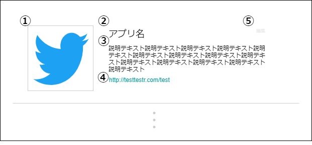
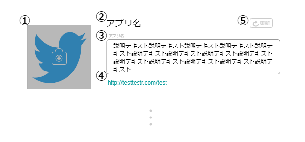

# 画面設計書(アプリ詳細)

## 表示
### 画面レイアウト

### 画面項目一覧

| No.   | 項目名         | 種類   | 有効 | 桁数 | 必須 | データ型 | 全半角 | 制約 | 初期表示 | 備考                            |
| :---- | :------------- | :----- | :--- | :--- | :--- | :------- | :----- | :--- | :------- | :------------------------------ |
| **1** | アプリアイコン | 画像   | 〇   | -    | -    | -        | -      | -    | 〇       | -                               |
| **2** | アプリ名       | ラベル | -    | -    | -    | -        | -      | -    | 〇       | -                               |
| **3** | アプリ説明     | ラベル | 〇   | -    | -    | -        | -      | -    | 〇       | リンクが貼られて いる時のみ |
| **4** | アプリリンク   | リンク | 〇   | -    | -    | -        | -      | -    | 〇       | -                               |
| **5** | 編集           | ボタン | 〇   | -    | -    | -        | -      | -    | 〇※      | ログイン時                      |

### 画面アクション定義

| No.   | 項目 | アクション名 | イベント名 | アクション処理概要 | アクション処理詳細 | 遷移先/呼出機能 | 備考 |
| :---- | :--- | :----------- | :--------- | :----------------- | :----------------- | :----- | ---- |
| **1** | - | 初期表示1 | - | アプリ情報を取得し表示する | - | [アプリ情報取得機能](../../3_dd/3.3.3.APIDesign.html) | - |
|**2**|1|画像押下1|アプリアイコン押下|アプリアイコンを 押下すると ポップアップ表示する|-|-|-|
|**3**|3|リンク押下1|アプリ説明リンク押下|アプリ説明内のリンクを 押下すると 画面遷移する|-|リンク先ページ|-|
|**4**|4|画像押下2|主要アプリ押下|主要アプリ画像を 押下すると 画面遷移する|-|外部アプリページ|-|
|**5**|5|ボタン押下1|アプリ編集押下| アプリ編集ボタンを 押下すると 画面遷移する | - |[アプリ詳細画面(編集)](./sc030.html#編集)|ログイン時|

## 編集
### 画面レイアウト

### 画面項目一覧

| No.   | 項目名 | 種類 | 有効 | 桁数 | 必須 | データ型 | 全半角 | 制約 | 初期表示 | 備考 |
| :---- | :----- | :--- | :--- | :--- | :--- | :------- | :----- | :--- | :------- | :--- |
| **1** | アプリアイコン | 画像 | 〇 | - | - | - | - | - | 〇 | - |
| **2** | アプリ名       | ラベル | -    | -    | -    | -        | -      | -    | 〇       | -                               |
|  **3**  | アプリ説明入力フォーム | テキストボックス | 〇 | 200 | 〇 | 文字列 | 全角 | - | 〇 | - |
| **4** | アプリリンク   | リンク | -  | -    | -    | -        | -      | -    | 〇       | -                               |
|  **5**  | 更新ボタン | ボタン | 〇 | - | - | - | - | - | 〇 | - |

### 画面アクション定義

| No.   | 項目 | アクション名 | イベント名 | アクション処理概要 | アクション処理詳細 | 遷移先/呼出機能 | 備考 |
| :---- | :--- | :----------- | :--------- | :----------------- | :----------------- | :----- | ---- |
|**1**|1|画像押下1|アプリアイコン 押下|アプリアイコンを押下後、 新しいアプリアイコンを 選択し、画面に反映する|① アプリアイコンを押下すると、 が端末の画像ファイル 選択が出てくる ② 画像を選択すると、 画像が項目No.1に反映される|-|-|
|**2**|5|ボタン 押下1|更新ボタン 押下|更新ボタン押下後、 アプリ情報を更新して、 画面に内容を反映する|-|[アプリ情報更新機能](../../3_dd/3.3.3.APIDesign.html) [アプリ詳細画面(表示)](./sc030.html#表示)|-|

