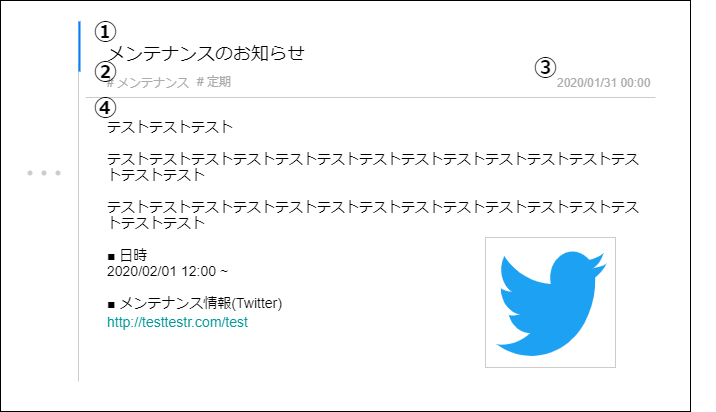

# 画面設計書(通知詳細)

### 画面レイアウト

### 画面項目一覧

| No.   | 項目名       | 種類   | 有効 | 桁数 | 必須 | データ型 | 全半角 | 制約                | 初期表示 | 備考         |
| :---- | :----------- | :----- | :--- | :--- | :--- | :------- | :----- | :------------------ | :------- | :----------- |
| **1** | 通知タイトル | ラベル | -    | -    | -    | -        | -      | -                   | -        | -            |
| **2** | 通知タグ     | リンク | 〇   | -    | -    | -        | -      | #タグ名             | -        | -            |
| **3** | 通知日時     | ラベル | -    | -    | -    | -        | -      | yyyy/MM/dd hh:mm:ss | -        | -            |
| **4** | 通知詳細     | HTML   | ※    | ※    | ※    | ※        | ※      | ※                   | ※        | 内容に応じる |

### 画面アクション定義

| No.   | 項目 | アクション名 | イベント名 | アクション処理概要 | アクション処理詳細 | 遷移先/呼出機能 | 備考 |
| :---- | :--- | :----------- | :--------- | :----------------- | :----------------- | :----- | ---- |
| **1** | 1~4 | 初期表示1 | - | 通知情報を取得し表示する | - | ※                        | sc040で取得した 情報を仕様 |
| **2** | - | 初期表示2 | - | 通知情報を更新する | 通知情報を既読したか否かの フラグを更新する | [通知情報更新機能](../../3_dd/3.3.3.APIDesign.html) | - |
| **3** | 2 | 通知タグ押下 | リンク押下 | タグでフィルターされた 状態で通知一覧を表示する | - | [通知一覧画面](./sc040.html) | - |
