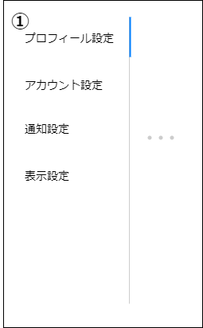

# 画面設計書(ユーザーアプリ一覧)

### 画面レイアウト

### 画面項目一覧

| No.   | 項目名       | 種類 | 有効 | 桁数 | 必須 | データ型 | 全半角 | 制約 | 初期表示 | 備考                                           |
| :---- | :----------- | :--- | :--- | :--- | :--- | :------- | :----- | :--- | :------- | :--------------------------------------------- |
| **1** | 追加         | タブ | 〇   | -    | -    | -        | -      | -    | ※        | ユーザーアプリ一覧画面遷移時、本項目アクティブ |
| **2** | 公開・非公開 | タブ | 〇   | -    | -    | -        | -      | -    | -        | -                                              |
| **3** | 並び替え     | タブ | 〇   | -    | -    | -        | -      | -    | -        | -                                              |
| **4** | 削除         | タブ | 〇   | -    | -    | -        | -      | -    | -        | -                                              |

### 画面アクション定義

|No.|項目|アクション名|イベント名|アクション処理概要|アクション処理詳細|遷移先/呼出機能|備考|
|:-|:-|:-|:-|:-|:-|:-|---|
|**1**| 1    | リンク押下1  |追加押下|小画面を切り替える|小画面でユーザーアプリ追加に切り替える|[ユーザーアプリ追加画面](./sc051.html)|-|
|**2**|2| リンク押下2  |公開・非公開押下|小画面を切り替える|小画面でユーザーアプリ公開に切り替える|[ユーザーアプリ公開画面](./sc052.html)|-|
|**3**|3| リンク押下3  |並び替え押下|小画面を切り替える|小画面でユーザーアプリ並び替えに切り替える|[ユーザーアプリ並び替え画面](./sc053.html)|-|
|**4**|4| リンク押下4  |削除押下|小画面を切り替える|小画面でユーザーアプリ削除に切り替える|[ユーザーアプリ削除画面](./sc054.html)|-|

