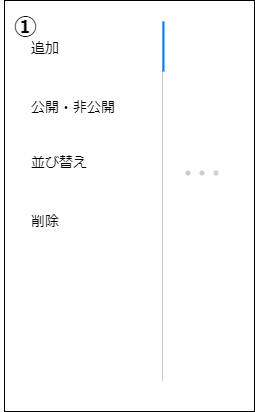

# 画面設計書(設定一覧)

### 画面レイアウト

### 画面項目一覧
| No.   | 項目名           | 種類   | 有効 | 初期表示                         | 備考 |
| :---- | :--------------- | :----- | :--- | :------------------------------- | :--- |
| **1** | プロフィール設定 | リンク | 〇   | 設定画面遷移時、本項目アクティブ | -    |
| **2** | アカウント設定   | リンク | 〇   | -                                | -    |
| **3** | 通知設定         | リンク | 〇   | -                                | -    |
| **4** | 表示設定         | リンク | 〇   | -                                | -    |

### 画面アクション定義

| No.   | 項目        | アクション名         | アクション処理概要 | アクション処理詳細 | 遷移先 | 備考 |
| :---- | :---------- | :------------------- | :----------------- | :----------------- | :----- | ---- |
| **1** | リンク押下1 | プロフィール設定押下 |                    |                    |        |      |
| **2** | リンク押下2 | アカウント設定押下   |                    |                    |        |      |
| **3** | リンク押下3 | 通知設定押下         |                    |                    |        |      |
| **4** | リンク押下4 | 表示設定押下         |                    |                    |        |      |