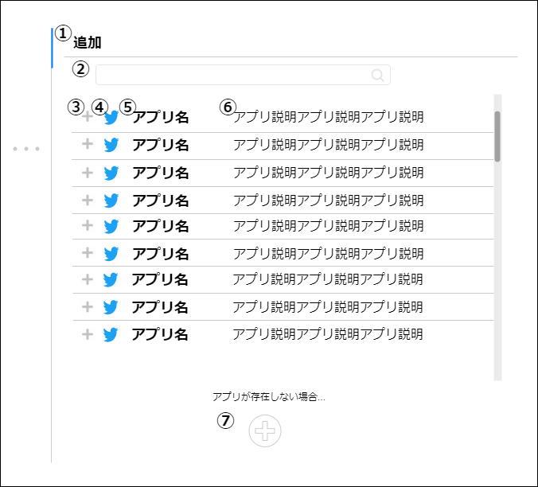
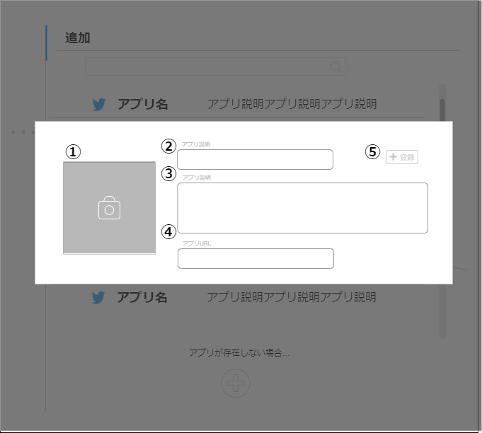

# 画面設計書(ユーザーアプリ追加)

## 本画面

### 画面レイアウト

### 画面項目一覧

| No.  | 項目名                     | 種類     | 有効 | 桁数 | 必須 | データ型 | 全半角 | 制約 | 初期表示 | 備考 |
| :--- | :------------------------- | :------- | :--- | :--- | :--- | :------- | :----- | :--- | :------- | :--- |
| 1    | 画面種類                   | ラベル   | -    | -    | -    | -        | -      | -    | 追加     | -    |
| 2    | 検索                       | フォーム | 〇   | 20   | -    | 文字列   | 全角   | -    | 〇       | -    |
| 3    | ユーザーアプリ追加アイコン | 画像     | -    | -    | -    | 文字列   | -      | -    | 〇       | -    |
| 4    | アプリアイコン             | 画像     | 〇   | -    | -    | 画像     | -      | -    | 〇       | -    |
| 5    | アプリ名                   | ラベル   | -    | 20   | -    | 文字列   | -      | -    | 〇       | -    |
| 6    | アプリ説明                 | ラベル   | -    | 200  | -    | 文字列   | -      | -    | 〇       | -    |
| 7    | アプリ追加アイコン         | 画像     | 〇   | -    | -    | 画像     | -      | -    | 〇       | -    |

### 画面アクション定義

|No.|項目|アクション名|イベント名|アクション処理概要|アクション処理詳細|遷移先/呼出機能|備考|
|:-|:-|:-|:-|:-|:-|:-|---|
| 1 | 2 |              |            |                    |                    |                 |      |
| 2 | 3 | | | | | | |
| 3 | 4 |              |            |                    |                    |                 |      |
| 4 | 7 |              |            |                    |                    |                 |      |

## アプリ新規追加ダイアログ

### 画面レイアウト

### 画面項目一覧

| No.  | 項目名 | 種類 | 有効 | 桁数 | 必須 | データ型 | 全半角 | 制約 | 初期表示 | 備考 |
| :--- | :----- | :--- | :--- | :--- | :--- | :------- | :----- | :--- | :------- | :--- |
|      |        |      |      |      |      |          |        |      |          |      |
|      |        |      |      |      |      |          |        |      |          |      |
|      |        |      |      |      |      |          |        |      |          |      |
|      |        |      |      |      |      |          |        |      |          |      |

### 画面アクション定義

|No.|項目|アクション名|イベント名|アクション処理概要|アクション処理詳細|遷移先/呼出機能|備考|
|:-|:-|:-|:-|:-|:-|:-|---|
|      |      |              |            |                    |                    |                 |      |
|      |      |              |            |                    |                    |                 |      |
|      |      |              |            |                    |                    |                 |      |
|      |      |              |            |                    |                    |                 |      |

アプリ情報追加機能

ユーザーアプリ追加機能

アプリ情報一覧取得機能