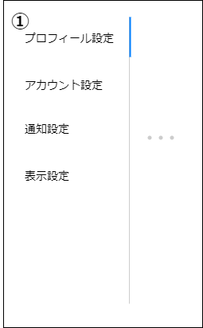

# 画面設計書(設定一覧)

### 画面レイアウト

### 画面項目一覧

| No.   | 項目名           | 種類   | 有効 | 桁数 | 必須 | データ型 | 全半角 | 制約 | 初期表示 | 備考                             |
| :---- | :--------------- | :----- | :--- | :--- | :--- | :------- | :----- | :--- | :------- | :------------------------------- |
| **1** | プロフィール設定 | リンク | 〇   | -    | -    | -        | -      | -    | ※        | 設定画面遷移時、本項目アクティブ |
| **2** | アカウント設定   | リンク | 〇   | -    | -    | -        | -      | -    | -        | -                                |
| **3** | 通知設定         | リンク | 〇   | -    | -    | -        | -      | -    | -        | -                                |
| **4** | 表示設定         | リンク | 〇   | -    | -    | -        | -      | -    | -        | -                                |

### 画面アクション定義

|No.|項目|アクション名|イベント名|アクション処理概要|アクション処理詳細|遷移先/呼出機能|備考|
|:-|:-|:-|:-|:-|:-|:-|---|
|**1**| 1    | リンク押下1  |プロフィール設定押下|小画面を切り替える|小画面でプロフィール設定に切り替える|[プロフィール設定画面](./sc051_054.html)|-|
|**2**|2| リンク押下2  |アカウント設定押下|小画面を切り替える|小画面でアカウント設定に切り替える|[アカウント設定画面](./sc051_054.html)|-|
|**3**|3| リンク押下3  |通知設定押下|小画面を切り替える|小画面で通知設定に切り替える|[通知設定画面](./sc051_054.html)|-|
|**4**|4| リンク押下4  |表示設定押下|小画面を切り替える|小画面で表示設定に切り替える|[表示設定画面](./sc051_054.html)|-|

