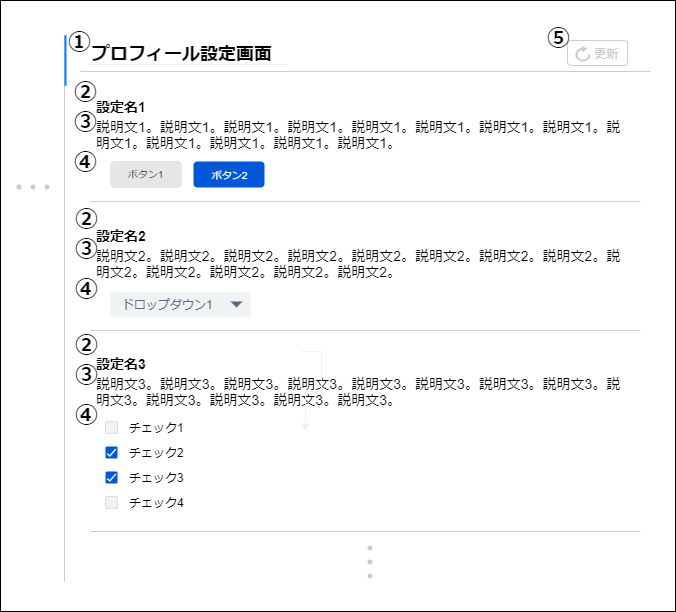

# 画面設計書(各設定画面)

### 画面レイアウト

### 画面項目一覧

| No.   | 項目名       | 種類   | 有効 | 桁数 | 必須 | データ型 | 全半角 | 制約 | 初期表示 | 備考                                                         |
| :---- | :----------- | :----- | :--- | :--- | :--- | :------- | :----- | :--- | :------- | :----------------------------------------------------------- |
| **1** | 設定タイトル | ラベル | -    | -    | -    | -        | -      | -    | -        | -                                                            |
| **2** | 更新         | ボタン | 〇   | -    | -    | -        | -      | -    | -        | -                                                            |
| **3** | 設定名       | ラベル | -    | -    | -    | -        | -      | -    | -        | -                                                            |
| **4** | 設定詳細     | ラベル | -    | -    | -    | -        | -      | -    | -        | -                                                            |
| **5** | 設定値       | ※      | -    | -    | -    | -        | -      | -    | -        | ボタン、ドロップダウン、 テキストボックス、チェック ボックス、等 |

### 画面アクション定義

| No.   | 項目 | アクション名 | イベント名 | アクション処理概要 | アクション処理詳細 | 遷移先/呼出機能 | 備考 |
| :---- | :--- | :----------- | :--------- | :----------------- | :----------------- | :----- | ---- |
| **0** | 3~5 | 初期表示1 | - | 設定情報を取得し表示する | - | [プロフィール設定情報取得機能](../../3_dd/3.3.3.APIDesign.html) [アカウント設定情報取得機能](../../3_dd/3.3.3.APIDesign.html) [表示設定情報取得機能](../../3_dd/3.3.3.APIDesign.html) [通知設定情報取得機能](../../3_dd/3.3.3.APIDesign.html) | - |
| **1** | 2 | ボタン押下1 | 更新ボタン押下 | 更新ボタン押下後、 画面の内容を反映する | - | [プロフィール設定情報更新機能](../../3_dd/3.3.3.APIDesign.html) [アカウント設定情報更新機能](../../3_dd/3.3.3.APIDesign.html) [表示設定情報更新機能](../../3_dd/3.3.3.APIDesign.html) [通知設定情報更新機能](../../3_dd/3.3.3.APIDesign.html) | - |
| **2** | 5 | 設定値操作1 | 設定値操作 | 設定値を設定する | - | - | - |